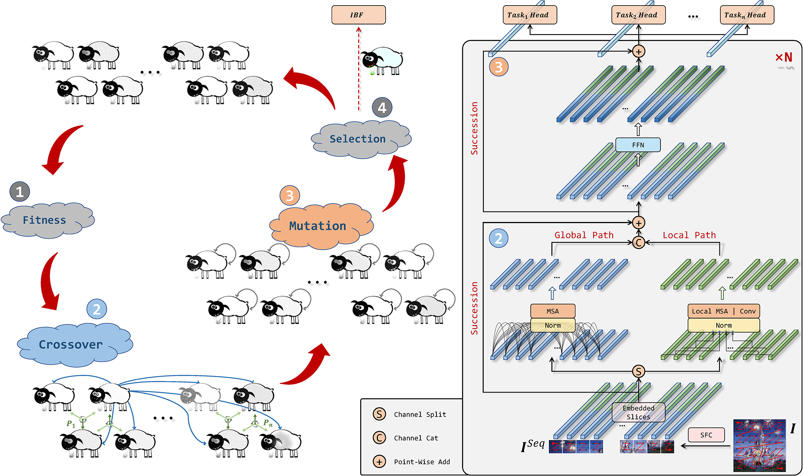

# Analogous to Evolutionary Algorithm: Designing a Unified Sequence Model
 

Official PyTorch implementation of "[Analogous to Evolutionary Algorithm: Designing a Unified Sequence Model, NeurIPS'21](https://arxiv.org/pdf/2105.15089.pdf)".



# Model Zoo

We provide EAT variants pre-trained on ImageNet-1k.

| Models & Urls | Top-1 | Params. | Throughput <br>(GPU) | Throughput <br>(CPU) | Inference Memory Occupancy| Image Size |
| --- | :---: | :---: | :---: | :---: | :---: | :---: |
| [EAT-Ti](https://april.zju.edu.cn/data/zhangzjn/visual_trans/EAT-weights/EAT-Ti.pth) | 72.7 | 5.7M | 2442 | 95.4 | 1448 | 224 x 224 |
| [EAT-S](https://april.zju.edu.cn/data/zhangzjn/visual_trans/EAT-weights/EAT-S.pth) | 80.4 | 22.1M | 1001| 34.4 | 1708 | 224 x 224 |
| [EAT-M](https://april.zju.edu.cn/data/zhangzjn/visual_trans/EAT-weights/EAT-M.pth) | 82.1 | 49.0M | 519 | 18.4 | 2114 | 224 x 224 |
| [EAT-B](https://april.zju.edu.cn/data/zhangzjn/visual_trans/EAT-weights/EAT-B.pth) | 82.0 | 86.6M | 329 | 11.7 | 2508 | 224 x 224 |
| [EAT-Ti (384)](https://april.zju.edu.cn/data/zhangzjn/visual_trans/EAT-weights/EAT-Ti-384.pth) | 75.8 | 5.8M | 721 | 20.5 | 1930 | 224 x 224 |
| [EAT-S (384)](https://april.zju.edu.cn/data/zhangzjn/visual_trans/EAT-weights/EAT-S-384.pth) | 82.4 | 22.2M | 312 | 8.7 | 2466 | 224 x 224 |
| [EAT-Ti (Dist)](https://april.zju.edu.cn/data/zhangzjn/visual_trans/EAT-weights/EAT-Ti-dist.pth) | 74.8 | 5.7M | 2442 | 95.4 | 1448 | 224 x 224 |
| [EAT-S (Dist)](https://april.zju.edu.cn/data/zhangzjn/visual_trans/EAT-weights/EAT-S-dist.pth) | 81.2 | 22.1M | 1001 | 34.4 | 1708 | 224 x 224 |
| [EAT-Ti (1000 epochs)](https://april.zju.edu.cn/data/zhangzjn/visual_trans/EAT-weights/EAT-Ti-1000e.pth) | 75.0 | 5.7M | 2442 | 95.4 | 1448 | 224 x 224 |
| [EAT-Ti (Dist+1000 epochs)](https://april.zju.edu.cn/data/zhangzjn/visual_trans/EAT-weights/EAT-Ti-dist-1000e.pth) | 77.0 | 5.7M | 2442 | 95.4 | 1448 | 224 x 224 |

# Using the Code

### Requirements

- This code has been developed under `python3.6.8`, `pytorch 1.6.0+cu101`, `torchvision 0.7.0`.

```shell
# Install python3 packages
pip3 install -r requirements.txt
```
- Refer to [DCNv2_latest](https://github.com/jinfagang/DCNv2_latest) if you want to use DCN as the local operator.

- We copy `timm` to protect against the potential impact of subsequent release updates.

## Data preparation

Download and extract [ImageNet-1k](http://image-net.org/) dataset in the following directory structure:

```
├── imagenet
    ├── train
        ├── n01440764
            ├── n01440764_10026.JPEG
            ├── ...
        ├── ...
    ├── train.txt (optional)
    ├── val
        ├── n01440764
            ├── ILSVRC2012_val_00000293.JPEG
            ├── ...
        ├── ...
    └── val.txt (optional)
```

## Evaluation

- To evaluate the pre-trained `EAT-Ti` on ImageNet-1k with a single GPU:
```
python3 main.py --model eat_progress3_patch16_224 --resume weights/EAT-Ti.pth --data-path /path/to/imagenet --output_dir ./tmp --eval  
```
or with multiple GPUs:
```
python3 -m torch.distributed.launch --nproc_per_node=8 --use_env main.py --model eat_progress3_patch16_224 --resume weights/EAT-Ti.pth --data-path /path/to/imagenet --dist_url tcp://127.0.0.1:23456 --output_dir ./tmp --eval 
```
This should give `Top-1 72.876`

- To evaluate the pre-trained `EAT-Ti` (with distillation) on ImageNet-1k with a single GPU:
```
python3 main.py --model eat_progress3_patch16_224_dist --resume weights/EAT-Ti-dist-1000e.pth --data-path /path/to/imagenet --output_dir ./tmp --eval  
```
or with multiple GPUs:
```
python3 -m torch.distributed.launch --nproc_per_node=8 --use_env main.py --model eat_progress3_patch16_224_dist --resume weights/EAT-Ti-dist-1000e.pth --data-path /path/to/imagenet --dist_url tcp://127.0.0.1:23456 --output_dir ./tmp --eval 
```
This should give `Top-1 76.856`

- More evaluation commands:

<details>

<summary>
EAT-Ti
</summary>

```
python3 main.py --model eat_progress3_patch16_224 --resume weights/EAT-Ti.pth --data-path /path/to/imagenet --output_dir ./tmp --eval  
```
This should give `Top-1 72.876`

</details>


<details>

<summary>
EAT-S
</summary>

```
python3 main.py --model eat_progress6_patch16_224 --resume weights/EAT-S.pth --data-path /path/to/imagenet --output_dir ./tmp --eval  
```
This should give `Top-1 80.422`

</details>


<details>

<summary>
EAT-M
</summary>

```
python3 main.py --model eat_progress9_patch16_224 --resume weights/EAT-M.pth --data-path /path/to/imagenet --output_dir ./tmp --eval  
```
This should give `Top-1 82.052`

</details>


<details>

<summary>
EAT-B
</summary>

```
python3 main.py --model eat_progress12_patch16_224 --resume weights/EAT-B.pth --data-path /path/to/imagenet --output_dir ./tmp --eval  
```
This should give `Top-1 82.026`

</details>


<details>

<summary>
EAT-Ti-384
</summary>

```
python3 main.py --model eat_progress3_patch16_384 --input-size 384 --resume weights/EAT-Ti-384.pth --data-path /path/to/imagenet --output_dir ./tmp --eval  
```
This should give `Top-1 75.806`

</details>


<details>

<summary>
EAT-S-384
</summary>

```
python3 main.py --model eat_progress6_patch16_384 --input-size 384 --resume weights/EAT-S-384.pth --data-path /path/to/imagenet --output_dir ./tmp --eval  
```
This should give `Top-1 82.398`

</details>


<details>

<summary>
EAT-Ti-dist
</summary>

```
python3 main.py --model eat_progress3_patch16_224_dist --resume weights/EAT-Ti-dist.pth --data-path /path/to/imagenet --output_dir ./tmp --eval  
```
This should give `Top-1 74.834`

</details>


<details>

<summary>
EAT-S-dist
</summary>

```
python3 main.py --model eat_progress6_patch16_224_dist --resume weights/EAT-S-dist.pth --data-path /path/to/imagenet --output_dir ./tmp --eval  
```
This should give `Top-1 81.206`

</details>


<details>

<summary>
EAT-Ti-1000e
</summary>

```
python3 main.py --model eat_progress3_patch16_224 --resume weights/EAT-Ti-1000e.pth --data-path /path/to/imagenet --output_dir ./tmp --eval  
```
This should give `Top-1 74.990`

</details>


<details>

<summary>
EAT-Ti-dist-1000e
</summary>

```
python3 main.py --model eat_progress3_patch16_224_dist --resume weights/EAT-Ti-dist-1000e1.pth --data-path /path/to/imagenet --output_dir ./tmp --eval  
```
This should give `Top-1 77.030`

</details>


## Training

To train `EAT-Ti` and `EAT-Ti-dist` on ImageNet-1k on a single node with 8 GPUs:


EAT-Ti
```
python3 -m torch.distributed.launch --nproc_per_node=8 --use_env main.py --model eat_progress3_patch16_224 --batch-size 128 --input-size 224 --opt adamw --lr 5e-4 --loc_encoder sis --epochs 300 --cls_token False --cls_token_head True --depth_cls 2 --block_type base_local --local_type conv --local_ratio 0.5 --mlp_ratio 4 --data-path /path/to/imagenet --output_dir /path/to/save
```

EAT-Ti-dist
```
python3 -m torch.distributed.launch --nproc_per_node=8 --use_env main.py --model eat_progress3_patch16_224_dist --batch-size 128 --input-size 224 --opt adamw --lr 5e-4 --loc_encoder sis --epochs 300 --cls_token False --cls_token_head True --depth_cls 2 --block_type base_local --local_type conv --local_ratio 0.5 --mlp_ratio 4 --distillation_type hard --teacher_model regnety_160 --teacher_path /path/to/teacher/model/weights --data-path /path/to/imagenet --output_dir /path/to/save
```


# Citation
If our work is helpful for your research, please consider citing:

```
@misc{zhang2021analogous,
      title={Analogous to Evolutionary Algorithm: Designing a Unified Sequence Model}, 
      author={Jiangning Zhang and Chao Xu and Jian Li and Wenzhou Chen and Yabiao Wang and Ying Tai and Shuo Chen and Chengjie Wang and Feiyue Huang and Yong Liu},
      year={2021},
      eprint={2105.15089},
      archivePrefix={arXiv},
      primaryClass={cs.CV}
}
```

# Acknowledgements
We thank following works for providing assistance for our research:
- [DeiT](https://github.com/facebookresearch/deit) for providing the baseline code.
- [numpy-hilbert-curve](https://github.com/PrincetonLIPS/numpy-hilbert-curve) for realizing Hilbert SFC.
- [pyzorder](https://github.com/smatsumt/pyzorder) for realizing Z-Order SFC.
- [DCNv2_latest](https://github.com/jinfagang/DCNv2_latest) for providing the DCN_v2 code.
- [tirg](https://github.com/google/tirg) for providing the baseline code for the multi-modal experiments.
- [perceive-transform-and-act](https://github.com/aimagelab/perceive-transform-and-act) for providing the baseline code for the multi-modal experiments.
- [pytorch-grad-cam](https://github.com/jacobgil/pytorch-grad-cam) for saliency visualization.
